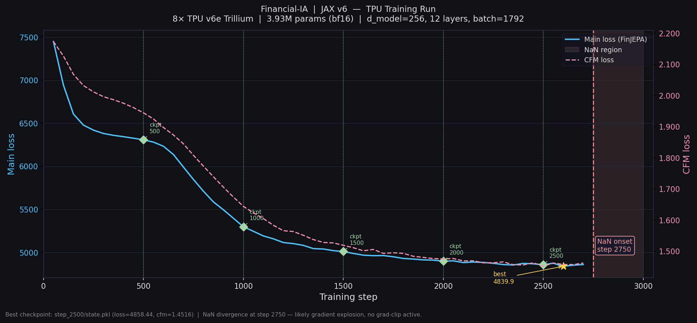

# ChaosAI — General Time-Series Foundation Model

> **Architecture:** Exo-Clocked Mamba-2 SSD + OT-CFM + VICReg JEPA
> **Framework:** JAX/Flax (TPU-native) + PyTorch (GPU validation)
> **Scale:** 184M params on TPU v5p-8 (95 GB HBM/chip)
> **Status:** v6e-8 validated (2,700 steps, -35% loss), scaling to v5p-8

> **DISCLAIMER: RESEARCH PURPOSE ONLY**
>
> This is an open-source research project exploring self-supervised learning on chaotic dynamical systems, using financial time series as a high-noise benchmark. **It is NOT a trading system.**
>
> - Nothing in this repository constitutes financial advice.
> - The authors are not responsible for any financial losses incurred by using this code.

[](https://www.gnu.org/licenses/agpl-3.0)
[](https://github.com/google/jax)
[](https://python.org/)

## 1. Why Financial Markets?

Financial markets are the most adversarial, non-stationary, and noise-dominated dynamical system publicly accessible at high frequency. They exhibit fat-tailed distributions, regime shifts, correlated chaos across 400+ instruments, and adversarial feedback loops.

We chose this domain as a **proving ground** — if a self-supervised architecture can learn meaningful latent representations here, it transfers to less adversarial time-series domains (biomedical signals, geophysics, audio, video dynamics) where the signal-to-noise ratio is orders of magnitude better.

## 2. Architecture (4 Strata)

### Strate I — Perception (SymLog + FSQ Tokenizer)
Compresses raw OHLCV candles into discrete codes via Dilated Causal CNN + **SymLog** (preserves fat tails) + **Finite Scalar Quantization** (1024 codes, zero codebook collapse).

### Strate II — World Model (Exo-Clocked Mamba-2 JEPA)
Self-supervised Joint-Embedding Predictive Architecture with:
- **Mamba-2 SSD** (State Space Duality) — chunked dense matmuls replacing selective scan. Custom JAX kernel optimized for 128×128 MXU tiles.
- **Volume-Conditioned Delta** — the SSM discretization step `dt` is modulated by realized volatility, giving the model an adaptive temporal clock (processes volatile regimes at finer granularity).
- **VICReg** self-supervised objective with block masking — no labels, no lookahead bias.

### Strate III — Multiverse Predictor (OT-CFM)
**Optimal Transport Continuous Flow Matching** — Sinkhorn coupling + diffrax ODE integration to generate multimodal future trajectories in latent space. Replaces the MLP predictor with a velocity field trained via OT interpolants.

### Strate IV — Agent (TD-MPC2 + CVaR)
Model-based RL agent that plans inside the differentiable latent space:
- **TD-MPC2** with MPPI tree search in latent space
- **Distributional critic** (ensemble quantile) optimizing **CVaR 5%** — survives the worst 5% of futures generated by Strate III

## 3. JAX/TPU Implementation

The primary training path is JAX-native (`src/jax_v6/`), designed for TPU pods.

### TPU-Native Design
- **Chunked SSD kernel** (`ssd.py`) — bf16 intermediates, weekend gating, causal masking. Fills MXU tiles exactly (chunk_size=128, head_dim=128).
- **GSPMD** parallelism via `jax.sharding.Mesh` + `NamedSharding`. Zero `pmap`.
- **Grain** async multi-host data pipeline — ArrayRecord format, prefetch buffer depth 128.
- **Diffrax** ODE integration with Sinkhorn OT coupling (JIT-compatible, no scipy).
- **Conditional remat** — gradient checkpointing on/off per hardware (v6e: on, v5p: off).

### Validated on TPU v6e-8 (February 2026)
- 3.9M params (d_model=256), 8 Trillium chips
- 2,700 training steps: loss 7448 → 4839 (-35%), CFM loss 2.17 → 1.45 (-33%)
- 0.3 steps/s with remat + synchronous data loading

### Scaling to TPU v5p-8
- **184M params**: d_model=1024, expand=2, n_heads=16, n_layers=24
- batch=8192 (1024/chip), no remat (95 GB HBM), async prefetch
- Gradient clipping (max_norm=1.0), donate_argnums, XLA compilation cache
- Estimated ~40 GB / 95 GB HBM per chip (42% utilization)

## 4. Training Results (v6e-8)



| Metric | Start | End (step 2700) | Change |
|---|---|---|---|
| Total loss | 7448 | 4839 | -35% |
| CFM loss | 2.17 | 1.45 | -33% |
| Steps/s | 0.3 | 0.3 | stable |

Training diverged at step 2750 (NaN) due to missing gradient clipping — now fixed with `optax.clip_by_global_norm(1.0)`.

## 5. Long-Term Vision

The architecture is domain-agnostic — the tokenizer converts raw signals to discrete codes, and everything downstream operates on abstract token sequences. Planned extensions:

- **Biomedical signals** — EEG/ECG anomaly detection (seizure onset, arrhythmia)
- **Geophysics** — gravitational wave detection (LIGO), seismic precursors
- **Audio** — bioacoustics, speech dynamics
- **Video** — frame-level latent prediction via JEPA spatial-temporal masking

## 6. Project Structure

```
ChaosAI/
├── src/
│   ├── strate_i/              # SymLog + FSQ tokenizer (PyTorch)
│   ├── strate_ii/             # FinJEPA v6 — Mamba-2 + OT-CFM (PyTorch)
│   ├── strate_iv/             # TD-MPC2 + CVaR agent (PyTorch)
│   └── jax_v6/                # JAX/TPU-native implementation
│       ├── encoders/          # Chunked SSD, Mamba-2 block, causal conv
│       ├── predictors/        # Predictor + FlowPredictor (Diffrax + Sinkhorn)
│       ├── losses/            # VICReg (float32 covariance)
│       ├── training/          # TrainState, GSPMD sharding, JIT train step
│       ├── data/              # Grain async multi-host loader (ArrayRecord)
│       ├── config.py          # All hyperparameters
│       └── jepa.py            # FinJEPA model (encoder + predictor + CFM)
├── scripts/
│   ├── setup_tpu_vm.sh        # TPU VM dependency setup
│   ├── tpu_train_pipeline.sh  # Training launcher (async prefetch, GCS sync)
│   └── convert_pt_to_arrayrecord.py
├── configs/                   # YAML configurations per strate
└── infra/                     # GCP startup scripts
```

## 7. Quick Start (TPU)

```bash
# 1. Create TPU VM
gcloud compute tpus tpu-vm create chaosai \
    --zone=us-east1-d --accelerator-type=v5p-8 \
    --version=tpu-vm-tf-2.16.1-pjrt --preemptible

# 2. Deploy code + setup deps
gcloud compute tpus tpu-vm scp --recurse . chaosai:~/Financial_IA --zone=us-east1-d
gcloud compute tpus tpu-vm ssh chaosai --zone=us-east1-d \
    --command="bash Financial_IA/scripts/setup_tpu_vm.sh"

# 3. Launch training
gcloud compute tpus tpu-vm ssh chaosai --zone=us-east1-d \
    --command="nohup bash Financial_IA/scripts/tpu_train_pipeline.sh &"
```

## 8. Tech Stack

| Component | Technology |
|---|---|
| Training (primary) | JAX + Flax + Optax |
| SSM kernel | Custom Chunked SSD (bf16) |
| ODE integration | Diffrax |
| Optimal transport | Sinkhorn (JIT-compatible) |
| Data pipeline | Google Grain + ArrayRecord |
| Parallelism | GSPMD (NamedSharding) |
| Checkpointing | Orbax |
| Training (GPU legacy) | PyTorch + Lightning |
| RL agent | TD-MPC2 (custom) |
| Infrastructure | GCP TPU v5p-8 / v6e-8 |

## 9. References

- LeCun, *A Path Towards Autonomous Machine Intelligence* (JEPA, 2022)
- Gu & Dao, *Transformers are SSMs: Generalized Models and Efficient Algorithms Through Structured State Space Duality* (Mamba-2 / SSD, 2024)
- Lipman et al., *Flow Matching for Generative Modeling* (CFM, 2022)
- Tong et al., *Improving and Generalizing Flow-Based Generative Models with Minibatch Optimal Transport* (OT-CFM, 2023)
- Hansen et al., *TD-MPC2: Scalable, Robust World Models for Continuous Control* (2024)
- Mentzer et al., *Finite Scalar Quantization: VQ-VAE Made Simple* (FSQ, 2023)
- Bardes et al., *VICReg: Variance-Invariance-Covariance Regularization* (2022)
- Assran et al., *Self-Supervised Learning from Images with a Joint-Embedding Predictive Architecture* (I-JEPA, 2023)

## License

[GNU Affero General Public License v3.0](LICENSE) — any use of this code, including as a network service, requires publishing the complete source of derivative works under the same license.
